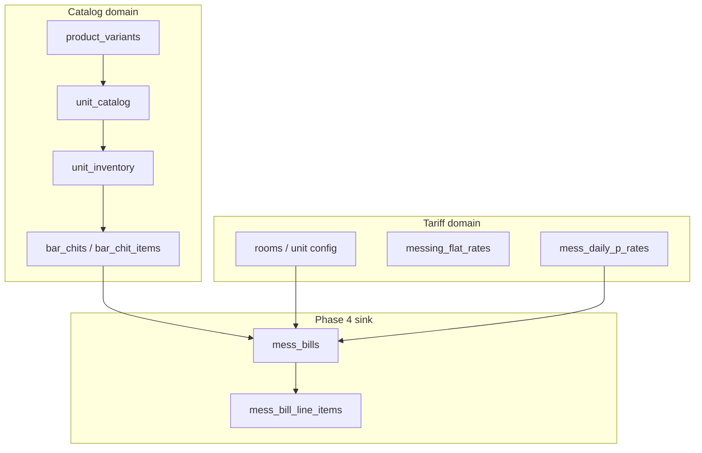
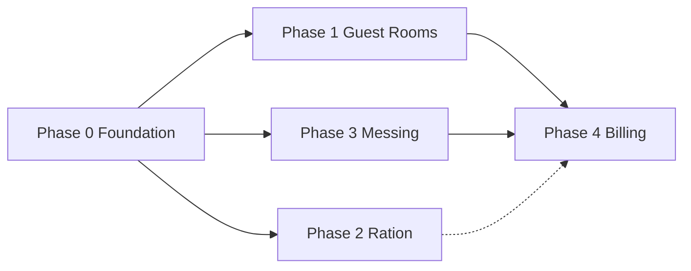

# Foundation — architecture, master data, phases

> **Status:** September 2026 — Phase 0 schema **applied** (`20260909183414_catalog_foundation_reset.sql`: global products, `unit_catalog`, `unit_menu_rates`; `products.unit_id` dropped)  
> **Requirements:** [`requirements.md`](./requirements.md) · **Schema contract:** [`SHARED-DATA-MODEL.md`](./SHARED-DATA-MODEL.md)

---

## 1. What we are building

Multi-tenant SaaS for Indian Officers' Messes. One **unit** = one mess. Two apps share one Supabase project:

| App | Role |
|-----|------|
| **Ops** (this repo) | Daily operations — bar, rooms, ration, messing, billing |
| **Admin** (companion) | Platform catalog, multi-unit admin, global ration scales |

**Tenant isolation:** RLS on `unit_id` + `requireCapability()` on every server action.

---

## 2. Master data — recommended redesign

### 2.1 Research summary

Industry MDM for multi-tenant product catalogs ([Claro MDM guide](https://getclaro.ai/resources/guides/mdm-data-model-product-catalogs/), multi-tenant MDM patterns) converges on:

1. **Separate entities** — Product (identity) ≠ Variant (stockable unit) ≠ Lot (where/how much/cost) ≠ Sale price (snapshot or menu policy).
2. **Global base + tenant adoption** — One canonical catalog; tenants enable items and override **local** attributes (SKU, menu rate), not product names.
3. **Hybrid is OK** — Not everything is a catalog item. Tariffs (room rent, flat messing rate) belong in **unit config**, not the product table.
4. **Keep it relational** — No separate PIM service until many tenants; Postgres + clear tables is enough.

### 2.2 Target model (simple)

```
Platform (Admin app writes)
  categories → products → product_variants     ← global identity only

Unit (Ops app writes)
  unit_catalog          ← adoption: which variants this mess uses
  unit_menu_rates       ← optional peg/bottle sale rate (not lot cost)
  unit_inventory        ← FIFO lots (qty_packs, rate, acquired_on)
  ration_scale_item_versions / ration_stock_transactions

Transactions (immutable facts)
  bar_chit_items        ← variant_id + rate snapshot
  ration_consumptions   ← variant_id + qty
```

| Table | Purpose |
|-------|---------|
| `products` | **Global only.** Canonical name (e.g. "Old Monk"). `name_normalized` for dedup. |
| `product_variants` | Stockable/sellable unit (750 ML BOTTLE). **The join key** (`variant_id`) everywhere. |
| `unit_catalog` | `(unit_id, variant_id, is_enabled, local_sku)`. Units **adopt**, never create products. |
| `unit_menu_rates` | `(unit_id, variant_id, rate, effective_from)`. Committee peg rate; optional. |
| `unit_inventory` | Lot cost + quantity; FIFO depletion (already implemented in bar). |

**Dropped / deprecated:**

- `products.unit_id` — **dropped** (Phase 0 applied). Products are global only.
- Ops-app product creation — replace with search + adopt.
- `v_items_current.current_rate = 0` — populate from `unit_menu_rates` or drop column from API.

### 2.3 Two domains (do not merge)

| Domain | Examples | Identity | Price |
|--------|----------|----------|-------|
| **Catalog** | Bar spirits, ration items, grocery stock | `variant_id` required | Lot rate + menu rate + sale snapshot |
| **Tariff** | Room rent, guest food/night, flat messing, subscriptions | Unit config / room row | Fixed amounts on config tables |

**Rule:** Guest room folio lines for rent/food stay **tariff** (description + amount). Bar lines synced to folio use **`variant_id`**. Do not create fake catalog rows for "Room rent."

### 2.4 Old Monk end-to-end

```
1. Admin: global product "Old Monk" → variant 750 ML BOTTLE (V1)
2. Unit adopts V1 in unit_catalog; menu rate ₹45/peg in unit_menu_rates
3. Stock: unit_inventory lots (6 sealed + 0.6 open @ lot cost ₹420)
4. Sale: bar chit → FIFO depletes open bottle → line { variant_id: V1, rate: 45, qty }
5. Mess bill: rolls up chit totals by member (Phase 4)
6. Analytics (later): GROUP BY variant_id, rank, unit — no string matching
```

### 2.5 Foundation reset (migration 0)

Approved approach: **purge operational data, fix catalog, re-seed.**

| Step | Action |
|------|--------|
| 1 | ✅ Applied: `unit_catalog`, `unit_menu_rates`, `products.name_normalized`; `products.unit_id` dropped |
| 2 | Truncate (per unit or full dev): `bar_chit_items`, `bar_chits`, `unit_inventory`, `ration_*` ops, `room_bill_items`, `mess_bills`, unit-scoped `products` |
| 3 | Seed global catalog (top SKUs by category) from Admin app |
| 4 | Unit re-adopts variants; bulk import → adopt + create lot with rate |
| 5 | Code: ops masters UI = adopt only; admin = CRUD global catalog |

**Capabilities:** `masters.read`, `masters.write` (unit adopt + menu rates), `masters.write.global` (admin catalog).

---

## 3. Master data × phase audit

| Phase | Uses `variant_id`? | Pricing | Catalog alignment | Action |
|-------|-------------------|---------|-------------------|--------|
| **Bar / stock** | ✅ Native | Lot + chit snapshot | Reference impl | Keep; default menu rate from `unit_menu_rates` |
| **Phase 2 Ration** | ✅ Native | Scale qty; stock tx rate | Good | Bulk import → adopt + scale/lot |
| **Phase 1 Guest rooms** | ⚠️ Partial | Tariff (rent, ₹900 food) | Bar FK OK; folio free-text | Bar sync sets `variant_id`; rent/food stay tariff |
| **Phase 3 Messing** | ❌ N/A | P-register / flat rates | Correct — not catalog | Guest meal default from unit config |
| **Phase 4 Billing** | ❌ On output | Sums source docs | Loses variant at sink | Optional `variant_id` on detail lines later; bar/ration analytics read source tables |

**Phase 2 + bar** = template for catalog modules. **Phases 1, 3, 4** = tariff aggregation — do not force catalog onto messing or room rent.

---

## 4. Money paths (schema)

Three paths — sources never FK to `mess_bills`; engine reads and writes sink.

```
A) STANDALONE     booking → room_bill → paid at checkout
B) MEMBER BILL    profile → mess_bill ← aggregates sources (26th–25th)
C) UNIT LEDGER    ration consumption, kitchen spend — not on member bill
```



---

## 5. Phase plan (single live unit)

| Phase | Scope | Blocks first mess bill? |
|-------|-------|-------------------------|
| **0 — Foundation** | Catalog reset + adoption + bulk import fix | Yes |
| **1 — Guest rooms** | Check-in/out, folio, bar→folio, host settlement | Yes (bar/room rollup) |
| **2 — Ration** | Ledger, consumption, reports | No (excluded from mess bill) |
| **3 — Kitchen / messing** | P-register or flat rate, guest meals, meal cuts | Yes |
| **4 — Monthly bill** | Compute engine, publish, email | Yes |



### P0 blockers (first published bill)

| ID | Issue |
|----|-------|
| CP-01 | Foundation: catalog adoption + import rate |
| CP-02 | Bar chit finalize (`signed` → `finalized` in billing query) |
| CP-03 | Bar → room folio sync with `variant_id` |
| CP-04 | Room rollup date filter (checkout not `created_at`) |
| CP-05 | Guest meals `is_billed` / idempotent re-run |
| CP-06 | P-register approval + attendance finalize hook |
| CP-07 | `booked_by` → `host_profile_id` in billing actions |
| CP-08 | Apply pending migrations on remote |

Details: phase gap registers in [`phases/`](./phases/).

---

## 6. Pending migrations (remote)

Apply before phase work (backup first):

| Migration | Adds |
|-----------|------|
| `20260613000000_messing_billing_flat_rates.sql` | Flat rates, billing mode |
| `20260614000000_messing_kitchen_and_monthly_billing.sql` | Kitchen, P-rates, mess bills |
| `20260615000000_guest_rooms_saas_enhancements.sql` | Host, settlement on room bills |
| ✅ `20260909183414_catalog_foundation_reset.sql` | Phase 0 applied — `unit_catalog`, `unit_menu_rates`, `name_normalized`; `products.unit_id` dropped |

---

## 7. Document map

| Need | Read |
|------|------|
| Business rules | [`requirements.md`](./requirements.md) |
| Table/column contract | [`SHARED-DATA-MODEL.md`](./SHARED-DATA-MODEL.md) |
| Phase field matrices | [`phases/PHASE-1-GUEST-ROOMS.md`](./phases/PHASE-1-GUEST-ROOMS.md) … [`PHASE-4`](./phases/PHASE-4-MONTHLY-BILLING.md) |
| UI tokens | [`design-system.md`](./design-system.md) |
