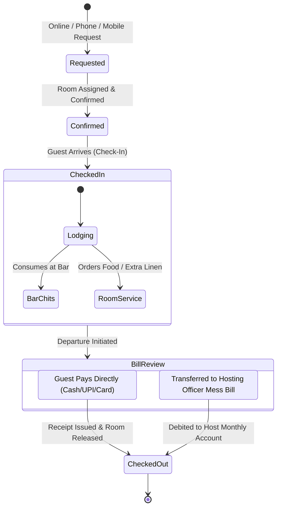
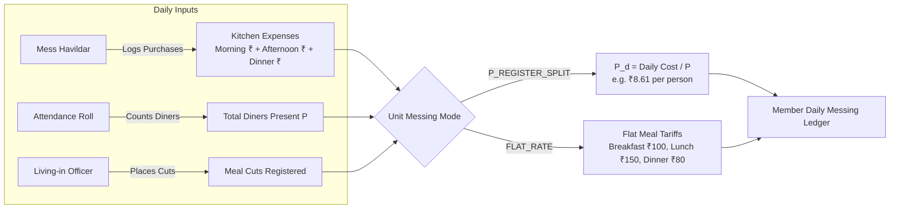
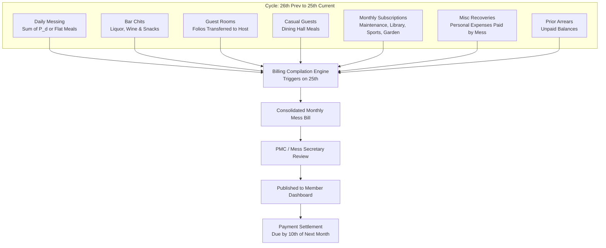
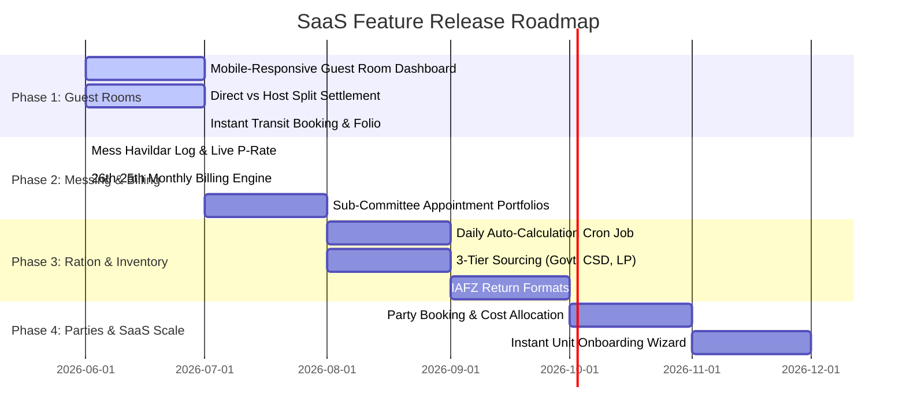

# Officers' Mess Management System (SaaS) — System Requirements Specification (SRS) & Architecture

> **Document ID:** OM-SRS-2026-V1  
> **Classification:** Indian Armed Forces Mess Operations & SaaS Architecture Standard  
> **Status:** Approved Baseline for Phased Implementation  
> **Author:** Antigravity AI & Mess Management Engineering  

---

## 1. Executive Summary & SaaS Vision

The **Officers' Mess Management System** is a multi-tenant SaaS platform built to modernize, streamline, and automate the specialized operational, culinary, financial, and entitlement workflows of Indian Armed Forces Officers' Messes (Army, Navy, Air Force, and paramilitary forces).

Unlike standard hospitality ERPs, a military Officers' Mess operates under:
1. **Regimental Traditions & Special Army Orders (SAOs)**.
2. **Strict Non-Profit Cooperative Ledger Accounting**.
3. **Multi-Source Sourcing & Entitlement**: Free Government of India (ASC) rations, CSD (Canteen Stores Department) subsidized goods, and Local Purchase (LP) fresh market produce.
4. **Monthly Settlement Cycle (26th to 25th)** with closed-loop member dues recovery.
5. **Honorary & Functional Command Hierarchy** (Commanding Officer / Chairman, PMC, Mess Secretary, Sub-Committee Member appointments, and operational NCOs).

### 1.1 The Multi-Tenant SaaS Paradigm
- **Instant Unit Onboarding**: A new military unit (Infantry Battalion, Armoured Regiment, Air Force Station, Naval Base, or Headquarters) can be onboarded in under 5 minutes with default room catalogs, ASC ration scales, sub-committee appointments, and accounting preferences seeded.
- **Modular Capability Subscriptions**:
  - **Full Operational Mess**: Messing, Attendance, Ration, Bar, Guest Rooms, Parties, Billing, Inventory.
  - **Transit Mess Mode**: High turnover of transient officers, flat-rate meals, guest room reservations, expedited checkout.
  - **Standalone Guest Room Management**: For guest houses, holiday homes, or unit officers who only need room inventory, mobile bookings, and guest billing.
- **Mobile-First Accessibility**:
  - Mess Secretaries and Guest Room NCOs can manage bookings, check-ins, and approvals on the go (e.g., in transit, on TD/leave, or from a phone).

---

## 2. Organizational Hierarchy & Role-Based Access Control (RBAC)

The system enforces a dual-layered hierarchy: **System Roles** and **Regimental Appointments**. An officer can hold multiple simultaneous appointments without requiring multiple logins.

```mermaid
graph TD
    CO[Commanding Officer / Chairman<br/>Honorary Head & Supreme Oversight] --> PMC[President Mess Committee - PMC<br/>Second-in-Command / Policy & Sanctions]
    PMC --> MS[Mess Secretary<br/>Operational Head of Mess]
    
    subgraph Sub-Committee Members (Officers with Portfolios)
        FM[Food Member<br/>Audits Messing & Purchases]
        WM[Wine Member<br/>Audits Bar & Cellar]
        GM[Garden Member<br/>Manages Garden & Grounds]
        PM[Property Member<br/>Inventories, Silver & Breakages]
        LM[Library & Sports Member<br/>Periodicals & Recreation]
    end
    
    MS --> FM
    MS --> WM
    MS --> GM
    MS --> PM
    MS --> LM
    
    subgraph Operational Staff (NCOs & JCOs)
        MH[Mess Havildar<br/>Kitchen, Rations & Daily Expenses]
        BN[Bar NCO<br/>Bar Dispensing & Chits]
        WN[Wine NCO<br/>Procurement & Cellar Stock]
        GRN[Guest Room NCO / Clerk<br/>Bookings, Rooms & Lodging]
    end
    
    FM -.->|Audits| MH
    WM -.->|Audits| BN
    WM -.->|Audits| WN
    MS --> GRN
```

### 2.1 Role & Appointment Matrix

| Rank / Appointment | Regimental Role | System Permissions & Visibility | Key Workflows |
|---|---|---|---|
| **Commanding Officer (CO)** | **Chairman of the Mess** (Honorary Guest) | Read-only supreme visibility across all ledgers, audit logs, financials, and unit occupancy. | Executive dashboard, monthly audit review, major event approvals. |
| **Second-in-Command (2IC)** | **President Mess Committee (PMC)** | Full operational & administrative oversight. Final financial sanctioning authority. | Finalizes monthly mess bills, approves capital purchases, reviews sub-committee reports. |
| **Mess Secretary** | Executive Officer | Full write access to all mess modules; manages cycle closes, billing runs, and user roles. | Runs 26th–25th billing, publishes bills, resolves disputes, coordinates with vendor accounts. |
| **Food Member** | Officer Appointment | Gated access to Kitchen, Messing, and Ration ledgers. | Daily menu approvals, market grocery purchase verification, P-register audit. |
| **Wine Member** | Officer Appointment | Gated access to Bar & Cellar inventory. | Liquor procurement approvals, stock verification, bar chit audit, cellar spot-checks. |
| **Garden Member** | Officer Appointment | Gated access to Garden Fund & nursery expenses. | Approves plant/fertilizer purchases, manages nursery maintenance fund debits. |
| **Property Member** | Officer Appointment | Gated access to Room, Mess Silver, and Furniture inventories. | Quarterly silver muster, room furniture condition audit, damage/breakage assessments. |
| **Mess Havildar** | Senior NCO (Catering) | Kitchen expenditure entry, ASC ration receipts, meal preparation roll. | Enters morning, afternoon, and dinner market expenses; manages kitchen stock. |
| **Bar NCO / Wine NCO** | NCO (Bar & Cellar) | Bar chit creation, bottle opening, peg dispensing, daily bar register. | Signs bar chits against member ID or guest room, decrements bar stock lots. |
| **Guest Room Clerk** | NCO / Clerk | Room reservations, check-ins, check-outs, room service chits, lodging folio. | Mobile booking creation, room inventory inspection, checkout bill presentation. |
| **Dining Officer / Member** | Unit Officer / Member | Personal diner portal (own messing, bar chits, room bookings, bills). | Toggles meal cuts, hosts casual guests, views monthly statements, settles dues. |

---

## 3. Module Specifications & Operational Workflows

---

### Module 1: Guest Room Management (Phase 1 Release Focus)

The guest room system accommodates both **Outside/Transit Guests** and **Member-Hosted Guests** with flexible settlement models.



#### 1.1 Core Requirements
- **Mobile-First Instant Booking**:
  - An officer or clerk on travel (e.g. at a transit station or mall) can check live room availability across dates and confirm a booking within 3 taps.
- **Dual Guest Classification**:
  - **Outside / Transit Guest**: Billed at commercial/standard military guest house tariffs. At checkout, the bill is printed/emailed, the guest settles immediately via Cash, UPI, or Card, and the account is marked paid.
  - **Member-Hosted Guest** (e.g. Officer's parents, spouse, relatives): Can choose to pay directly on departure OR have the entire lodging and food folio transferred directly to the hosting officer's monthly mess bill.
- **Integrated Folio Accumulation**:
  - Room Rent (calculated by nights $\times$ room tariff).
  - Food / Catering charges (fixed meal packages or per-meal debits).
  - Bar Chits signed against room number (verified with guest signature).
  - Room Service & Extra Bed / Linen charges.
- **Room Inventory & Inspection**:
  - Each room has an inventory of furniture, electrical fittings, and linen. Condition recorded at check-in and checkout.

---

### Module 2: Daily Messing & P-Register Engine



#### 2.1 Core Requirements
- **Mess Havildar Daily Log**:
  - Enter actual expenditure for Morning (Breakfast), Afternoon (Lunch), and Dinner.
  - Tag sourcing: `LOCAL_PURCHASE` (fresh vegetables, dairy, poultry) vs `CANTEEN` (CSD dry grocery) vs `OTHER`.
- **Automated P-Register Rate ($P_d$) Calculation**:
  $$P_d = \frac{\text{Morning Expenses} + \text{Afternoon Expenses} + \text{Dinner Expenses}}{\text{Total Diners Present on Day } (P)}$$
- **Military Breakfast Presence Rule**:
  - If an officer is marked present for breakfast, they are automatically treated as present for the full day unless an official movement order or approved cut exists.
- **Diner Meal Cuts**:
  - Diners can log cuts for individual meals before cut-off time (e.g., 22:00 hrs for next day breakfast).
- **Casual Dining Guests**:
  - Officers hosting casual visitors in the dining hall log guest count and meal type, charged at predetermined guest tariffs.

---

### Module 3: Ration Management & Auto-Calculation Engine

The Government of India periodically issues standardized **Ration Scales** (grams per man per day based on rank class and terrain: Plains, Desert, High Altitude, Field, Sea).

#### 3.1 Core Requirements
- **SCD-2 Versioned Scale Repository**:
  - Scales versioned over time. When Ministry of Defence revises scales, past history remains immutable.
- **Daily Automated Entitlement Cron**:
  - Runs at midnight across all onboarded SaaS units.
  - Formula for each authorized item $i$:
    $$\text{Authorized Draw}_i = \text{Diners Present on Roll } (P) \times \text{Authorized Scale Qty}_i$$
- **ASC Indent & Balance Reconciliation**:
  - Tracks ASC Supply Depot receipts vs kitchen draws vs balance on hand.
  - Automatically flags surplus or deficiency against monthly sanctioned entitlement.
- **Entitlement Cost Rules**:
  - Living-in members are entitled to free government rations $\implies$ **₹0 charged to member**.
  - Non-entitled casual guests or private parties consuming ration items are billed at predetermined government-notified issue rates.

---

### Module 4: 26th-to-25th Monthly Billing & Settlements



#### 4.1 Core Requirements
- **Fixed Accounting Window**:
  - Period strictly opens on the **26th of month $M-1$** and closes on the **25th of month $M$**.
- **Automated Multi-Component Aggregation**:
  1. Messing Charges (P-split or flat rate minus cuts).
  2. Bar Lounge consumption (`bar_chits`).
  3. Room Charges transferred to member (`room_bills`).
  4. Casual Guest Meals (`guest_meals`).
  5. Recurring Subscriptions (Mess Maintenance Fund, Library, Sports, Garden Fund).
  6. Miscellaneous debits / recoveries paid by mess on member's behalf.
  7. Arrears carried forward.
- **Settlement Tracking**:
  - Due date: 10th of the following month.
  - Payment options: UPI/QR, NEFT/RTGS, Cheque, or Regimental Salary Remittance.

---

### Module 5: Parties & Special Functions

Military messes host both collective official gatherings and private officer celebrations.

#### 5.1 Classification & Billing
1. **Mess Functions (Official)**:
   - *Examples*: Regimental Raising Day, Dining-In / Dining-Out of CO/PMC, National Day, Officers' Mess Guest Night.
   - *Cost Treatment*: Borne by the **Mess Fund** or subsidized per capita from special entertainment grants. Rations drawn against official strength.
2. **Private Parties (Individual Hosted)**:
   - *Examples*: Wedding Anniversary, Child Birthday, Promotion Celebrations, Farewell Cocktails.
   - *Cost Treatment*: Hosted by an individual officer. Billed for:
     - Special banquet menu catering.
     - Bar liquor chits / bottle draws at CSD + mess handling surcharge.
     - Mess staff overtime / extra bearer charges.
     - Hall / Lawn maintenance fees.
     - Can use either private purchase or authorized mess inventory with appropriate markups.

---

## 4. Phased Feature Release Strategy



---

## 5. Architectural Gap Analysis & Remediation Plan

| Domain Area | Current Codebase State | Real-World SaaS Requirement | Remediation Plan |
|---|---|---|---|
| **Guest Rooms: Split Settlement** | Checkout marks bill `finalized` with no payment mode. | Must support direct payment (cash/UPI) with receipt OR transfer to host officer's mess bill. | Add `settlement_type` (`DIRECT_PAYMENT`, `CHARGE_TO_HOST`) and `payment_status` to `room_bills`. |
| **Guest Rooms: Host Profile Link** | `bookings` has `created_by` but no explicit `host_profile_id` or `guest_category`. | Distinguish transit officers, outside civilians, and member family (parents, spouse). | Add `host_profile_id` FK and `booking_category` enum to `bookings`. |
| **Sub-Committee Appointments** | Fixed enum on `profiles.role` (`super_admin`, `unit_admin`, `mess_secretary`, `mess_havildar`, etc.). | An officer can be both a Diner and the Food Member, or Wine Member + Garden Member simultaneously. | Create `unit_appointments` table linking `profile_id`, `unit_id`, and `appointment_type` (`food_member`, `wine_member`, etc.). |
| **Ration Auto-Calculation Cron** | `ration_consumptions` is queried manually by date. | Automated cron job calculates daily scale draws for all onboarded messes at midnight. | Implement Next.js cron runner / background job applying active scales to attendance in MongoDB. |
| **Parties & Events** | `/party` renders placeholder. | Booking tool for Official Functions vs Private Officer Parties with customized billing. | Build `parties` schema, budget allocations, and billing integration. |
| **Instant Unit Onboarding** | Admins manually seed database records. | SaaS wizard to onboard a unit in 5 minutes with defaults (rooms, mess type, scales). | Build `/admin/onboarding` self-service wizard. |
